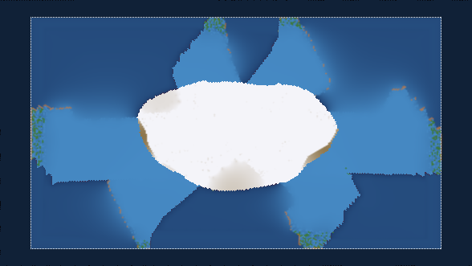

# Tectonic Explorer — Unity 2D core



A plate-tectonics simulation driving a **12-foot top-down projection** in a museum gallery.
Visitors push tectonic plates around with their hands and watch what follows: trenches open,
volcanic arcs light up, mountain ranges grow where continents collide.

Ported from Concord Consortium's
[Tectonic Explorer](https://github.com/concord-consortium/tectonic-explorer) (TypeScript /
three.js / geodesic sphere) to C# on a **bounded 2D region**. Not a faithful port — the
geology is carried over; the geometry, the physics ownership and the update semantics are all
deliberately different.

**The exhibit is what explains the code.** Several small plates a visitor can shove, arranged
around an immovable centre; a region of a larger world rather than a whole planet; running
unattended all day and rebooted each morning; resetting itself when the room empties. Nearly
every design decision below follows from one of those.
**→ [`ARCHITECTURE.md`](ARCHITECTURE.md)** traces each constraint to the decision it forced.

---

## Layout

```
core/       the simulation. NO UnityEngine reference. Plain C#, Unity.Mathematics only.
headless/   a host that stands in for Unity, so the core can be run and verified offline.
unity/      the Unity bridge: Rigidbody2D, walls, mesh renderer, settings asset.
tests/      28 tests, ~6 s.
scripts/    fetch-deps.sh — pulls Unity.Mathematics, which is NOT redistributed here
            because it is under the Unity Companion License. See NOTICE.md.
```

| | |
|---|---|
| [`ARCHITECTURE.md`](ARCHITECTURE.md) | why the code is shaped this way, traced back to the exhibit |
| [`CONTRIBUTING.md`](CONTRIBUTING.md) | three rules, and the "cleanups" that aren't |
| [`NOTICE.md`](NOTICE.md) | attribution and third-party licensing |

The split is the point. `core/` is where the bugs will be and where they are hardest to
debug through a running exhibit, so it is built to run without Unity at all:

```sh
./scripts/fetch-deps.sh            # once — see NOTICE.md for why this isn't vendored
./run-headless.sh --steps 2500 --scenario radial
dotnet test tests/Tectonic.Tests   # 28 tests, ~6 s
```

The headless run simulates a few hundred million years, writes PNG maps, and asserts a set
of invariants — exiting non-zero if any fails. `--help` lists the flags. Both run in CI.

---

## The decisions worth knowing

*Summarised here; the full reasoning, the measurements and the exhibit constraints behind
each one are in [`ARCHITECTURE.md`](ARCHITECTURE.md).*

### 1. Everything is a sparse overlay on a hex lattice

A plate is **a set of cells on its own local hex lattice, plus a rigid transform**. Cells
never move relative to their plate; plate motion is entirely position and rotation.

This is inherited from the original, where a plate was a set of cell ids plus a quaternion
over a shared geodesic sphere. Flattening the sphere deleted ~1,650 lines: the icosahedral
subdivision, the 12 pentagons, the peel-seam adjacency, the kd-tree, and a 205 KB Voronoi
raster whose entire job was answering "which cell is at this point". On a regular lattice
that question is a division and a rounding.

Two plates' lattices do not align in world space — exactly as before. Overlap is tested by
inverse-transforming a world point into the other plate's frame. `Plate.TryCellAtWorld`.

### 2. Unity owns integration and walls. The core owns plate-vs-plate.

| | Owner | Why |
|---|---|---|
| Plate motion | `Rigidbody2D` | Unity integrates it; the core only emits force and torque |
| Plate ↔ wall | Unity's solver | Non-penetration against a static wall is what a solver is *for* |
| Plate ↔ plate | The core | Plates **must interpenetrate** — subduction is one plate sliding under another. A contact solver would spend every frame undoing that. |

The layer collision matrix enforces the split: `Plates ↔ Walls` on, `Plates ↔ Plates` off.
See `TectonicSetup`.

Each plate carries a `PolygonCollider2D` that is a **convex hull**, not its real outline,
rebuilt every ~30 steps. It only ever touches walls, off-screen, where contact geometry is
invisible.

`Rigidbody2D.linearDamping` is left at zero: drag is computed per cell in the core (it
depends on each cell's velocity and area), and doing it in both places damps the plates to
a standstill within a hundred steps.

### 3. Jacobi, not Gauss–Seidel

Every operation in the geology sweep is a **gather**: a cell computes its new state from its
own and its neighbours' *old* state, and writes only itself. No cell ever writes into a
neighbour.

The original does the opposite — cells push sediment and metamorphism into their neighbours,
so cells processed later in a step see earlier cells' writes. Its own source comments admit
this makes results depend on `Map` insertion order and diverge visibly over long runs.

Reformulating scatter as gather buys three things:

- **Order independence.** Results don't depend on iteration order, so they're reproducible.
- **Parallelism for free.** The per-cell loops can go to `Parallel.For`, or later to Burst
  and Jobs, without changing a line of physics.
- **It's easier to reason about.** No question of what a neighbour's state means mid-step.

Mass is conserved by making every transfer symmetric: a cell's outflow and its neighbour's
matching inflow are both computed from the same old state, so they agree exactly.

Randomness is derived from `hash(seed, step, plate, cell)` rather than drawn from a shared
stream — a shared stream would reintroduce order dependence through the back door.

### 4. Anchored plates

`Plate.IsStatic` marks a plate that participates in everything — collisions, subduction,
mountain building, crust generation — but that forces never move. Mechanically it is just
"ignore Force/Torque": the host skips integration, and Unity sets the body **kinematic**
(not static, so the reset animation can still move it by script; Unity still resolves
dynamic-vs-kinematic contacts).

The side effect is the point. An anchored plate is an infinitely heavy collision partner,
so anything a visitor shoves into it decelerates hard and spends that energy building
relief. **The result of a push is a mountain range, not a translation.**

`WorldBuilder.RadialScenario()` builds the exhibit topology: an anchored central continent
with a ring of smaller mobile plates around it, at deliberately unequal angles, distances and
speeds — regular wedges converging on a disc produce a six-pointed flower, which is an
artifact of the initial condition rather than of the physics.

### 5. The margin is frozen, not destroyed

The simulated region is larger than the visible one. Crust outside the visible rectangle is
**retained and transported, but its geology is skipped**.

This is the reversibility guarantee. A visitor can shove a continent off-screen and pull it
back, and it returns bit-identical rather than as fresh sea floor. Destroying off-screen
crust would be cheaper and would break that.

Memory is bounded by the walls: ~1.7× the visible cell count, and it cannot grow past that.
Frozen cells also skip the dominant per-cell cost, so most of the extra area is free.

Genuinely empty space — a plate retreating from a wall — is filled with new ocean through
the same divergent-boundary path used everywhere else. **The walls are off-screen spreading
ridges.** They also supply a gentle **ridge push**, which is the ambient drive that keeps the
map evolving between visitors, with a physical justification rather than as a fudge.

---

## Resolution

`CellsAcrossVisibleWidth` is the single resolution knob, set at startup. **Everything spatial
is authored in world units, never in cells**, and per-cell values are derived in
`TectonicConfig.Rebuild()`.

That distinction is the whole point. A constant like "the bending front decays by 0.25 per
neighbour" quietly means a different physical distance at every resolution — double the grid
and the trench comes out half as wide. Subduction width, continent buffers, metamorphic
halos, surface transport and per-cell event rates all have this problem. Authoring in world
units and deriving per-cell values keeps the geology looking like the same planet at 120
cells across or at 560.

### Measured — `./run-headless.sh bench`

4 logical cores in a container, so treat these as a shape rather than as exhibit-hardware
numbers. `hex@12ft` is the on-screen hexagon size for a 12-foot-wide display.

| across | cell size | hex@12ft | cells | serial ms | parallel ms | mem MB | load @10 Hz |
|---|---|---|---|---|---|---|---|
| 120 | 0.667 | 1.20" | 11,773 | 4.4 | 4.6 | 7.3 | **4.6%** |
| 180 | 0.444 | 0.80" | 26,481 | 8.1 | 8.8 | 12.4 | **8.8%** |
| 240 | 0.333 | 0.60" | 47,065 | 15.6 | 18.1 | 18.7 | **18%** |
| 320 | 0.250 | 0.45" | 83,785 | 29.9 | 31.3 | 31.4 | **31%** |
| 420 | 0.190 | 0.34" | 143,867 | 56.5 | 52.3 | 52.7 | **52%** |
| 560 | 0.143 | 0.26" | 256,054 | 127.2 | 115.9 | 87.9 | **116%** |

Cost scales with the square of the knob. `load @10 Hz` is the fraction of **one** core needed
to sustain 10 geology steps/sec — halve it by running geology at 5 Hz, which no visitor will
notice at geological timescales.

### Sizing for the target display: 3840 x 2160 projector, 12 ft wide, 16:9

The visible region is **128 x 72 world units**, exactly 16:9, so hexes come out regular on
screen rather than subtly stretched.

The instinct is to raise the resolution until hexes stop being visible. Don't — that is the
expensive way to buy something cheap. At 320 cells across, one hexagon is **12 px** on a 4K
projector, and *flat-shaded* that reads as an obvious mosaic. But the mesh does not have to be
flat shaded.

**Corner vertices carry the average of the three cells meeting there**, so the fragment shader
interpolates across cell boundaries and the grid dissolves. Same cell count, same step cost,
no visible hexes. Visual resolution is decoupled from simulation resolution, and you buy
smoothness from the GPU instead of the CPU.

So pick the resolution for the GEOLOGY — how fine a trench, how narrow a volcanic arc, how
small an island you want to be able to represent — not for how smooth it looks.
**320 across (0.45", 12 px/hex) is a good default** at ~31% of one core for two plates.

Note that cost scales with PLATE COUNT as well as resolution: the 7-plate radial scenario runs
18 ms/step at 180 across against 8 ms for two plates, because collision detection is
O(candidates x plates). Re-run `bench` with a realistic plate count before committing.

### Two honest findings

**`Parallel.For` is worth less than it looks, and the number moved twice.** In an isolated
geology microbenchmark it measured 0.86–1.10× (not worth it), then 1.02–1.56× once a per-step
double-buffer memcpy was removed and stopped competing for bandwidth. But in a **full step**
below ~320 cells across it is ~1.0×, because the geology is only part of the step — and
`Parallel.For` allocates about **14 KB/step** against ~600 B serial.

So: **default off**, worth enabling above ~320 across where the gain reaches ~1.3×. The loop
is **memory-bandwidth-bound, not compute-bound** — `Cell` is ~104 bytes and each cell touches
its six neighbours, so a step streams ~700 bytes per cell through cache, and more threads
don't buy bandwidth.

The real lever is therefore **shrinking the working set**, not more parallelism — splitting
`Cell` into hot/cold arrays so the erosion pass touches only elevation and rock, and
narrowing fields that don't need 32 bits. That is also most of what a Burst conversion would
actually buy. Worth doing only if the measured load at your chosen resolution is a problem.

**Erosion clamps above ~240 across.** Explicit surface transport has a diffusion stability
limit: `k · dt · neighbours ≲ 1`, and `k` grows as `1/spacing²`. Above ~240 the coefficient is
capped and `TectonicConfig.ErosionClampedForStability` is raised so the host can warn. The
correct fix is a smaller `Timestep` at high resolution — the exhibit has the headroom, since
the geology tick is decoupled from the physics tick. Clamping is the safe default: an
unattended exhibit must never diverge.

## Measured behaviour

From `./run-headless.sh 1200 out 120` (1,200 steps = 144 Myr, ~11,800 cells, 2 plates):

```
mean step        4.4 ms
sim allocation   165 B/step steady-state
determinism      identical fingerprint across independent runs
```

Invariants checked every run: no NaN elevations, no live cell with an empty rock column,
subduction occurs, relief develops, plates stay inside the walls, steady-state allocation is
negligible, and two independent runs agree exactly.

### The allocation that actually mattered

The residual is plate-rect resizing, and it is worth more attention than the byte count
suggests. Those `Cell[]` arrays are **megabytes**, so they land on the **Large Object Heap** —
only collected with Gen2, and not compacted by default. Steady LOH churn means fragmentation
and periodic multi-tens-of-ms pauses over a multi-day run. That is the one GC failure mode an
unattended exhibit genuinely has.

Profiling per phase found it all in `GenerateNewCrust`, in bursts of 100 KB–800 KB. The fix
was noticing that the rect rarely needs to **grow** — a plate consumed at one margin and
growing at the other keeps roughly the same size while its origin *drifts*. So
`Plate.TryReorigin` slides the content within the existing arrays using a single reusable
scratch buffer, and only falls back to reallocating when the content genuinely will not fit.

Measured on the 7-plate radial scenario: **22.9 KB/step → 612 B/step**, a 37× reduction, and
below the LOH threshold entirely.

Allocation stays elevated for the first few thousand steps while plates expand to their
equilibrium extent, then decays. At 10 Hz that transient is a few minutes at startup, which
an exhibit can absorb.

---

## Why zero allocation is a hard requirement

Not an optimization. The original allocates ~8 `Vector3` objects per cell per force
evaluation — on the order of a million allocations per second. In a browser tab that is
survivable. In an exhibit running unattended for days it is GC death.

Hence: blittable `Cell` structs, a fixed 11-slot rock column instead of a `List<RockLayer>`,
preallocated scratch buffers, and `Array.Copy` for the double buffer. The only allocating
operation left is plate-rect regrowth, which stops once plates settle into a size.

---

## On DOTS

Don't, yet — and probably not ever for the whole project.

**There is no production 2D physics in DOTS.** `com.unity.2d.entities.physics` never left
`0.2.0-preview` and was tied to the discontinued Project Tiny; `com.unity.physics` is 3D.
Going full ECS would mean giving up `Rigidbody2D`, which is the thing Unity is being asked
to provide.

The endpoint, if ever, is hybrid: plates stay GameObjects (there are ~10 of them and their
physics cost is nil), and only the per-cell geology loop becomes jobs. That loop is already
shaped for it — struct-of-blittables, indexed by cell, gather-only. `Cell[]` becomes
`NativeArray<Cell>` and `GatherStep` becomes an `IJobParallelFor` with no change to the
physics.

The decision that could *not* be deferred was Jacobi vs Gauss–Seidel, because it changes
visible behaviour. That one is made.

---

## Unity setup

0. Pick a resolution: set `CellsAcrossVisibleWidth` on the settings asset (see the table
   above). Startup only — it cannot change during a run.
1. Copy `core/*.cs` into `Assets/Tectonic/Core/` alongside `unity/Core/Tectonic.Core.asmdef`
   (note `noEngineReferences: true` — if that ever flips, the headless harness is broken).
2. Copy `unity/Runtime/` into `Assets/Tectonic/Runtime/`.
3. Add the `com.unity.mathematics` package.
4. Create layers `TectonicPlates` and `TectonicWalls`.
5. Create a `Tectonic/Settings` asset, put a `TectonicRunner` in the scene, assign it.
6. Camera: orthographic, size = `VisibleHalfExtent.y`.

`TectonicRunner.PushAt(worldPoint, force)` is the visitor-input hook.
`TectonicRunner.IsSettled` is the cue to begin the slow reset.

---

## Not built yet

- **Save / restore.** Needed for the reset-to-default behaviour, and as the authoring path
  for the default scenario. The `Cell` struct is blittable, so this is a straight binary
  dump. Deliberately deferred, not overlooked.
- **Cross-sections.** In 2D the data side is a line walk over cells reading rock columns —
  roughly 50 lines, versus 481 in the original where great-circle sampling made it hard. The
  expensive part is drawing stratigraphy. Low priority per the brief, but the data path is
  cheap enough to be worth keeping open.
- **Reset animation**, presence detection, and visitor input hardware.
- **Plate splitting and merging.** The original divides plates by crust age and welds
  co-moving ones. Neither is needed for the first slice.
